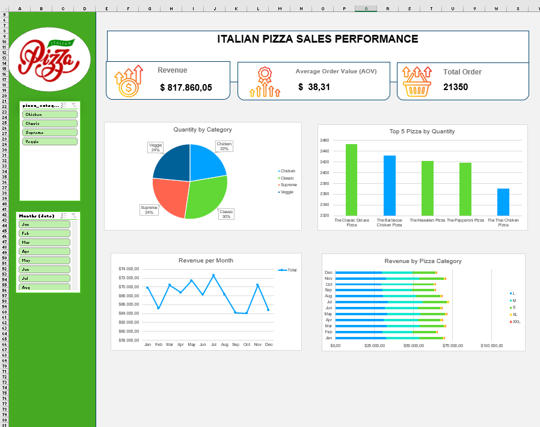

# 🍕 Italian Pizza Sales Performance Dashboard

## 📌 Project Overview
This project analyzes the sales performance of an Italian pizza business using transactional sales data.  
The goal is to uncover business insights related to revenue, customer purchasing behavior, top-selling products, and sales trends over time through an interactive dashboard.

---

## 🎯 Project Objective
The objective of this project is to:
- Evaluate overall sales performance
- Identify top-performing pizza categories and products
- Analyze monthly revenue trends
- Understand customer purchasing patterns through key metrics

This analysis helps support data-driven decision making for business growth and operational optimization.

---

## ❓ Business Questions (Key KPIs)
The dashboard answers the following key business questions:

1. What is the **total revenue** generated?
2. How many **total orders** were placed?
3. What is the **Average Order Value (AOV)**?
4. Which **pizza categories** generate the highest sales volume?
5. What are the **Top 5 best-selling pizzas** by quantity?
6. How does **revenue trend over time (monthly)**?
7. Which **pizza sizes** contribute the most to total revenue?

---

## 📊 Key Metrics
- **Total Revenue:** $817,860.05  
- **Total Orders:** 21,350  
- **Average Order Value (AOV):** $38.31  

---

## ⚙️ Data Analysis Process
1. **Data Understanding**  
   Reviewed pizza sales transaction data including order details, dates, categories, sizes, quantities, and prices.

2. **Data Cleaning**  
   - Ensured consistent date and time formats  
   - Removed duplicate records  
   - Validated numerical fields such as quantity and price  

3. **Data Transformation**  
   - Calculated Total Revenue  
   - Calculated Average Order Value (AOV)  
   - Aggregated sales by category, pizza name, size, and month  

4. **Data Visualization**  
   Built an interactive Excel dashboard containing:
   - KPI Cards (Revenue, Orders, AOV)
   - Quantity by Category (Pie Chart)
   - Top 5 Pizza by Quantity (Bar Chart)
   - Revenue per Month (Line Chart)
   - Revenue by Pizza Category & Size (Stacked Bar Chart)

---

## 📈 Insights & Findings
- **Classic Pizza** is the top-performing category, contributing approximately **30% of total quantity sold**.
- The **Top 5 best-selling pizzas** dominate overall sales volume, led by *The Classic Deluxe Pizza*.
- **Large (L)** and **Medium (M)** pizza sizes generate the highest revenue, indicating strong customer preference.
- Monthly revenue shows **seasonal fluctuations**, with peaks in mid-year and lower performance toward the end of the year.
- Sales distribution across categories is relatively balanced, reducing dependency on a single product type.

---

## ✅ Final Conclusion
The business demonstrates a **stable and healthy sales performance** with consistent revenue generation.  
Key recommendations include:
- Prioritizing promotion of **Classic category pizzas**
- Focusing inventory and marketing on **Large and Medium sizes**
- Running targeted campaigns during lower-performing months
- Leveraging top-selling pizzas for bundle or upselling strategies

This dashboard serves as a practical tool for monitoring performance and supporting strategic business decisions.

---

## 🛠 Tools Used
- Microsoft Excel  
  - Pivot Tables  
  - Charts & Slicers  
  - Dashboard Design  

---

## 📁 Dataset
https://docs.google.com/spreadsheets/d/146A8HN4DVF5XgnFICZued4IYyoLiWrDv/edit?usp=sharing&ouid=116795963460350939437&rtpof=true&sd=true

The dataset contains historical pizza sales transaction data, including:
- Order ID
- Order Date
- Pizza Name
- Category
- Size
- Quantity
- Price

## 📊Dashboard
 
---

## 📌 Author
**Danang Prayogi**  
Fresh Graduate – Informatics Engineering  
Aspiring Data Analyst
